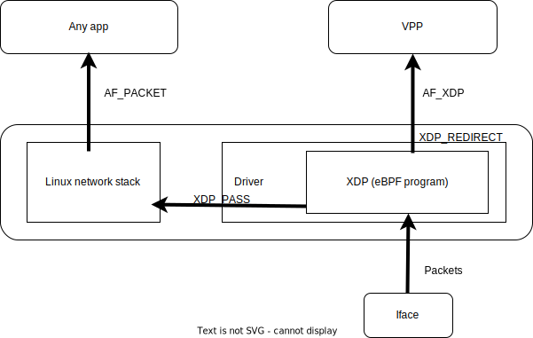

# AF_XDP forwarder-vpp management interface

Contains a setup for NSM that includes `nsmgr`, `forwarder-vpp`, `registry-k8s`, `admission-webhook`.
\
Unlike the [basic setup](../basic), which uses `AF_PACKET` management interface by default, we set `AF_XDP` here.

_**Note:** this is experimental feature. It may not work on some clusters._

The diagram below shows the movement of traffic within the forwarder-vpp:



Packets arriving at the network interface are processed by the eBPF program, which decides how to redirect the traffic.
If the packet belongs to the NSM interface it forwards it to the VPP, otherwise it goes to the Linux network stack.
## Requires

- [spire](../spire/single_cluster)

## Includes

- [Kernel to Ethernet to Kernel Connection](../use-cases/Kernel2Ethernet2Kernel)
- [Memif to Ethernet to Memif Connection](../use-cases/Memif2Ethernet2Memif)
- [Kernel to Ethernet to Memif Connection](../use-cases/Kernel2Ethernet2Memif)
- [Memif to Ethernet to Kernel Connection](../use-cases/Memif2Ethernet2Kernel)
- [Kernel to IP to Kernel Connection](../use-cases/Kernel2IP2Kernel)
- [Memif to IP to Memif Connection](../use-cases/Memif2IP2Memif)
- [Kernel to IP to Memif Connection](../use-cases/Kernel2IP2Memif)
- [Memif to IP to Kernel Connection](../use-cases/Memif2IP2Kernel)
- [Kernel2IP2Kernel IPv6 example](../features/ipv6/Kernel2IP2Kernel_ipv6)
- [Memif2IP2Memif IPv6 example](../features/ipv6/Memif2IP2Memif_ipv6)

## Run

Apply NSM resources for basic tests:

```bash
kubectl apply -k https://github.com/networkservicemesh/deployments-k8s/examples/afxdp?ref=c12385c824a364b9d89c09a984b6a691d5071237
```

Wait for admission-webhook-k8s:

```bash
WH=$(kubectl get pods -l app=admission-webhook-k8s -n nsm-system --template '{{range .items}}{{.metadata.name}}{{"\n"}}{{end}}')
kubectl wait --for=condition=ready --timeout=1m pod ${WH} -n nsm-system
```

## Cleanup

To free resources follow the next commands:

```bash
WH=$(kubectl get pods -l app=admission-webhook-k8s -n nsm-system --template '{{range .items}}{{.metadata.name}}{{"\n"}}{{end}}')
kubectl delete mutatingwebhookconfiguration ${WH}
kubectl delete ns nsm-system
```
