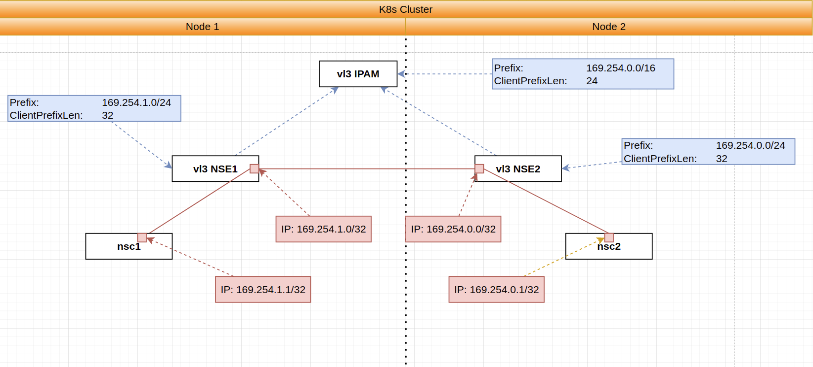

# vL3 single cluster example

This example shows how could be configured vL3 network via NSM.


Diagram: 




**NOTE: Forwarder and NSMmgr are missed in the diagram for the simplicity**


## Run


1. Create ns to deploy nse and nsc:

```bash
kubectl create ns ns-vl3
```


2. Deploy nsc and vl3 nses (See at `kustomization.yaml`):

```bash
kubectl apply -k https://github.com/networkservicemesh/deployments-k8s/examples/features/vl3-basic?ref=9b2e8e76fbc7505da8e87ea24bf90ac39f4b6c1a
```

3. Find all nscs:

```bash
nscs=$(kubectl  get pods -l app=nsc-kernel -o go-template --template="{{range .items}}{{.metadata.name}} {{end}}" -n ns-vl3) 
[[ ! -z $nscs ]]
```

4. Ping each client by each client:

```bash
for nsc in $nscs 
do
    ipAddr=$(kubectl exec -n ns-vl3 $nsc -- ifconfig nsm-1)
    ipAddr=$(echo $ipAddr | grep -Eo 'inet addr:[0-9]{1,3}\.[0-9]{1,3}\.[0-9]{1,3}\.[0-9]{1,3}'| cut -c 11-)
    for pinger in $nscs
    do
        echo $pinger pings $ipAddr
        kubectl exec $pinger -n ns-vl3 -- ping -c4 $ipAddr
    done
done
```

5. Ping each vl3-nse by each client. 

Note: By default we're using ipam prefix is `169.254.0.0/16` and client prefix len is `24`. We also have two vl3 nses in this example. So we are expect to have a two vl3 addresses: `169.254.0.0` and `169.254.1.0` that should be accessible by each client.

```bash
for nsc in $nscs 
do
    echo $nsc pings nses
    kubectl exec -n ns-vl3 $nsc -- ping 169.254.0.0 -c4
    kubectl exec -n ns-vl3 $nsc -- ping 169.254.1.0 -c4
done
```


## Cleanup


To cleanup the example just follow the next command:

```bash
kubectl delete ns ns-vl3
```