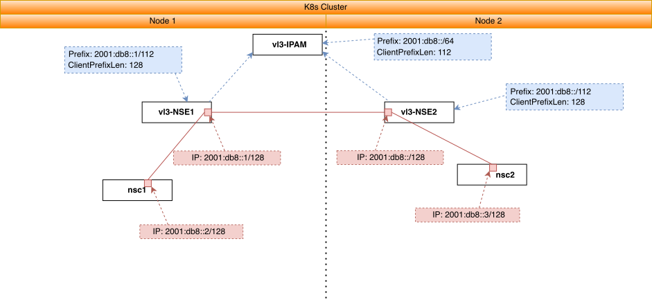

# vL3 IPv6 single cluster example

This example shows how could be configured vL3 IPv6 network via NSM.


Diagram: 




**NOTE: Forwarder and NSMmgr are not added in the diagram for the simplicity**


## Run

Deploy network service, nsc and vl3 nses (See at `kustomization.yaml`):
```bash
kubectl apply -k https://github.com/networkservicemesh/deployments-k8s/examples/features/vl3-ipv6?ref=0e8c3ce7819f0640d955dc1136a64ecff2ae8c56
```

Wait for clients to be ready:
```bash
kubectl wait --for=condition=ready --timeout=2m pod -l app=alpine -n ns-vl3-ipv6
```

Find all nscs:
```bash
nscs=$(kubectl get pods -n ns-vl3-ipv6 -l app=alpine -o go-template --template="{{range .items}}{{.metadata.name}} {{end}}")
[[ ! -z $nscs ]]
```

Ping each client by each client:
```bash
(
for nsc in $nscs
do
    ipAddr=$(kubectl exec -n ns-vl3-ipv6 $nsc -- ifconfig nsm-1) || exit
    ipAddr=$(echo $ipAddr | grep -Eo 'inet6 addr: 2001:.*' | cut -d ' ' -f 3 | cut -d '/' -f 1)
    for pinger in $nscs
    do
        if [ "$nsc" != "$pinger" ]; then
            echo $pinger pings $ipAddr
            kubectl exec $pinger -n ns-vl3-ipv6 -- ping6 -c2 -i 0.5 $ipAddr || exit
        fi
    done
done
)
```

Ping each vl3-nse by each client.
Note: ipam prefix is `2001:db8::/64` and client prefix len is `112`. We also have two vl3 nses in this example. So we expect to have two vl3 addresses: `2001:db8::` and `2001:db8::1:0` that should be accessible by each client.
```bash
(
for nsc in $nscs
do
    echo $nsc pings nses
    kubectl exec -n ns-vl3-ipv6 $nsc -- ping6 2001:db8:: -c2 -i 0.5 || exit
    kubectl exec -n ns-vl3-ipv6 $nsc -- ping6 2001:db8::1:0 -c2 -i 0.5 || exit
done
)
```

## Cleanup

To cleanup the example just follow the next command:
```bash
kubectl delete ns ns-vl3-ipv6
```
