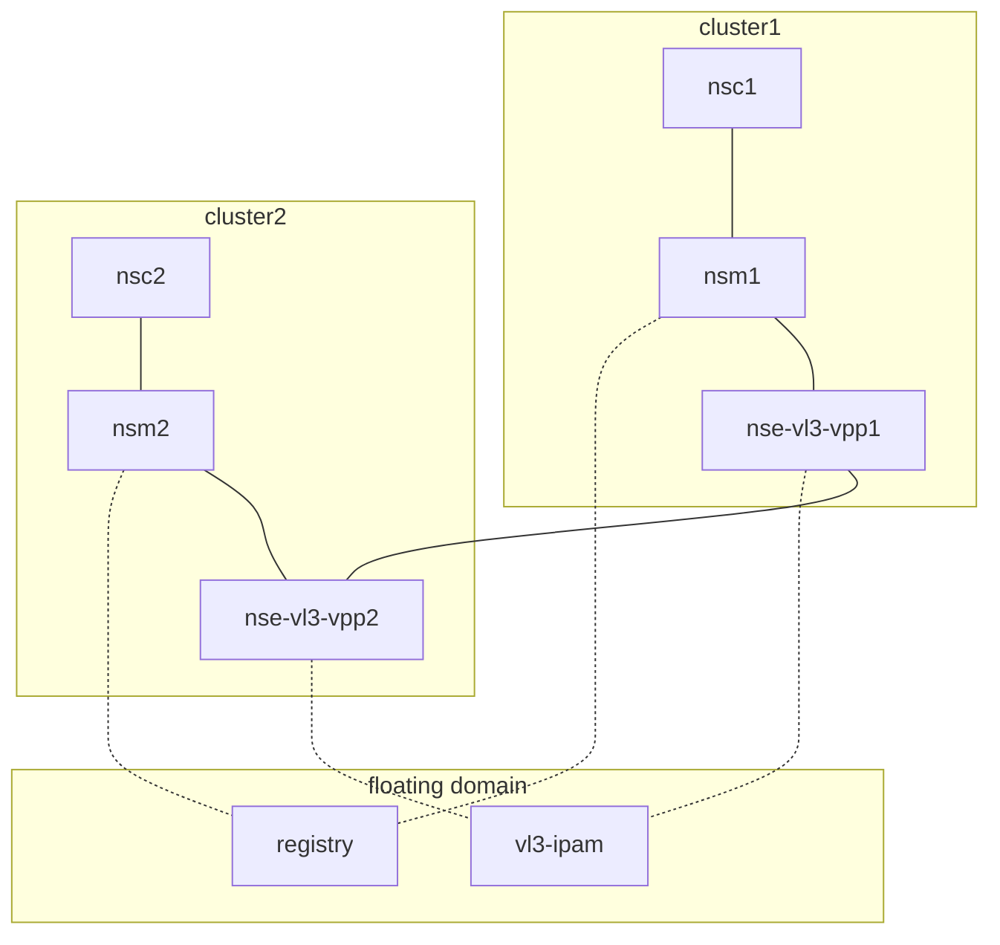

# NSM over interdomain vL3 network

## Description

This example show how can be configured NSM over interdomain via vL3 network.


## Requires

Make sure that you have completed steps from [interdomain](../../)

## Run

**1. Deploy**

1.1. Switch context to the *floating domain*.

```bash
export KUBECONFIG=$KUBECONFIG3
```

1.2. Start **vl3 ipam** and register **vl3 network service** in the *floating domain*.


Note: *By default we're using ipam prefix is `169.254.0.0/16` and client prefix len is `24`. We also have two vl3 nses in this example. So we are expect to have a two vl3 addresses: `169.254.0.0` and `169.254.1.0` that should be accessible by each client.*


```bash
kubectl apply -k https://github.com/networkservicemesh/deployments-k8s/examples/floating_interdomain/usecases/FloatingVl3/cluster3?ref=efad28978ca4d2cc3348fdca1475d962292459ef
```

1.3. Switch context to the *cluster1*.

```bash
export KUBECONFIG=$KUBECONFIG1
```

1.4. Prepare a patch with **vl3 ipam URL**:
```bash
cat > kustomization.yaml <<EOF
---
apiVersion: kustomize.config.k8s.io/v1beta1
kind: Kustomization

resources:
-  https://github.com/networkservicemesh/deployments-k8s/examples/floating_interdomain/usecases/FloatingVl3/cluster1?ref=efad28978ca4d2cc3348fdca1475d962292459ef

patchesStrategicMerge:
- patch-vl3-nse.yaml
EOF
```

```bash
kubectl apply -k https://github.com/networkservicemesh/deployments-k8s/examples/floating_interdomain/usecases/FloatingVl3/cluster1?ref=efad28978ca4d2cc3348fdca1475d962292459ef
```

1.5. Switch context to the *cluster2*.

```bash
export KUBECONFIG=$KUBECONFIG2
```

1.7. Prepare a patch with **vl3 ipam URL**:
```bash
cat > kustomization.yaml <<EOF
---
apiVersion: kustomize.config.k8s.io/v1beta1
kind: Kustomization

resources:
- https://github.com/networkservicemesh/deployments-k8s/examples/floating_interdomain/usecases/FloatingVl3/cluster2?ref=efad28978ca4d2cc3348fdca1475d962292459ef

patchesStrategicMerge:
- patch-vl3-nse.yaml
EOF
```

```bash
kubectl apply -k https://github.com/networkservicemesh/deployments-k8s/examples/floating_interdomain/usecases/FloatingVl3/cluster2?ref=efad28978ca4d2cc3348fdca1475d962292459ef
```


**2. Get assigned IP addresses**

2.1. Find NSC in the *cluster2*:

```bash
nsc2=$(kubectl get pods -l app=nsc-kernel -n ns-vl3-interdomain --template '{{range .items}}{{.metadata.name}}{{"\n"}}{{end}}')
```

2.2. Switch context to the *cluster1*.

```bash
export KUBECONFIG=$KUBECONFIG1
```

2.3. Find NSC in the *cluster1*:

```bash
nsc1=$(kubectl get pods -l app=nsc-kernel -n ns-vl3-interdomain --template '{{range .items}}{{.metadata.name}}{{"\n"}}{{end}}')
```

**3. Check connectivity**

3.1. Get assigned IP address from the vl3-NSE for the NSC2 and ping the remote client (NSC1):
```bash
ipAddr2=$(kubectl --kubeconfig=$KUBECONFIG2 exec -n ns-vl3-interdomain $nsc2 -- ifconfig nsm-1)
ipAddr2=$(echo $ipAddr2 | grep -Eo 'inet addr:[0-9]{1,3}\.[0-9]{1,3}\.[0-9]{1,3}\.[0-9]{1,3}'| cut -c 11-)
kubectl exec $nsc1 -n ns-vl3-interdomain -- ping -c 4 $ipAddr2
```

3.2. Ping vl3 nses:
```bash
kubectl exec $nsc1 -n ns-vl3-interdomain -- ping -c 4 169.254.0.0
kubectl exec $nsc1 -n ns-vl3-interdomain -- ping -c 4 169.254.1.0
```


3.3. Switch to the *cluster2*
```bash
export KUBECONFIG=$KUBECONFIG2
```

3.4. Get assigned IP address from the vl3-NSE for the NSC1 and ping the remote client (NSC2):
```bash
ipAddr1=$(kubectl --kubeconfig=$KUBECONFIG1 exec -n ns-vl3-interdomain $nsc1 -- ifconfig nsm-1)
ipAddr1=$(echo $ipAddr1 | grep -Eo 'inet addr:[0-9]{1,3}\.[0-9]{1,3}\.[0-9]{1,3}\.[0-9]{1,3}'| cut -c 11-)
kubectl exec $nsc2 -n ns-vl3-interdomain -- ping -c 4 $ipAddr1
```

3.5. Ping vl3 nses:
```bash
kubectl exec $nsc2 -n ns-vl3-interdomain -- ping -c 4 169.254.0.0
kubectl exec $nsc2 -n ns-vl3-interdomain -- ping -c 4 169.254.1.0
```

## Cleanup

1. Cleanup floating domain:

```bash
export KUBECONFIG=$KUBECONFIG3 && kubectl delete -k https://github.com/networkservicemesh/deployments-k8s/examples/floating_interdomain/usecases/FloatingVl3/cluster3?ref=efad28978ca4d2cc3348fdca1475d962292459ef
```

2. Cleanup cluster2 domain:

```bash
export KUBECONFIG=$KUBECONFIG2 && kubectl delete -k https://github.com/networkservicemesh/deployments-k8s/examples/floating_interdomain/usecases/FloatingVl3/cluster2?ref=efad28978ca4d2cc3348fdca1475d962292459ef
```

3. Cleanup cluster1 domain:

```bash
export KUBECONFIG=$KUBECONFIG1 && kubectl delete -k https://github.com/networkservicemesh/deployments-k8s/examples/floating_interdomain/usecases/FloatingVl3/cluster1?ref=efad28978ca4d2cc3348fdca1475d962292459ef
```
