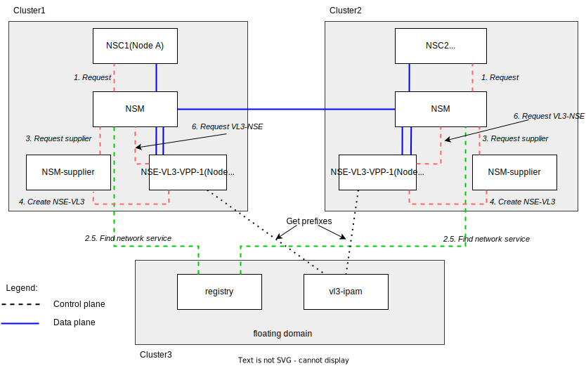

# NSM over interdomain autoscaled vL3 network

## Description

This example shows how to configure autoscaled vL3-network for interdomain.

The diagram is presented below.



## Requires

Make sure that you have completed steps from [interdomain](../../)

## Run

**1. Deploy**

1.1. Switch context to the *floating domain*.

```bash
export KUBECONFIG=$KUBECONFIG3
```

1.2. Start **vl3 ipam** and register **vl3 network service** in the *floating domain*.


Note: *By default we're using ipam prefix is `169.254.0.0/16` and client prefix len is `24`. We also have two vl3 nses in this example. So we are expect to have a two vl3 addresses: `169.254.0.0` and `169.254.1.0` that should be accessible by each client.*


```bash
kubectl apply -k https://github.com/networkservicemesh/deployments-k8s/examples/floating_interdomain/usecases/FloatingVl3_autoscale/cluster3?ref=3175354ab685daf0b2fc5ed7b0b6673b266956d8
```

1.3. Get an IP address assigned to **vl3-ipam**.

```bash
vl3_ipam_ip=$(kubectl get services vl3-ipam -n nsm-system -o go-template='{{index (index (index (index .status "loadBalancer") "ingress") 0) "ip"}}')
```

1.4. Switch context to the *cluster1*.

```bash
export KUBECONFIG=$KUBECONFIG1
```

1.5. First we need to prepare a pod-template for the supplier with a correct **vl3 ipam URL**. Let's use `kustomize` to create it:

```bash
cat > kustomization.yaml <<EOF
---
apiVersion: kustomize.config.k8s.io/v1beta1
kind: Kustomization

resources:
- https://raw.githubusercontent.com/networkservicemesh/deployments-k8s/3175354ab685daf0b2fc5ed7b0b6673b266956d8/examples/floating_interdomain/usecases/FloatingVl3_autoscale/cluster1/pod-template-base.yaml

patchesStrategicMerge:
- patch-pod-template.yaml
EOF
```

```bash
cat > patch-pod-template.yaml <<EOF
---
apiVersion: v1
kind: Pod
metadata:
  name: nse-vl3-vpp-1
spec:
  containers:
    - name: nse
      env:
        - name: NSM_PREFIXSERVERURL
          value: "tcp://$vl3_ipam_ip:5006"
EOF
```

Save `pod-template.yaml`:
```bash
kubectl kustomize -o 'pod-template.yaml'
```

1.6. Create `kustomization` file with a configmap for supplier:

```bash
cat > kustomization.yaml <<EOF
---
apiVersion: kustomize.config.k8s.io/v1beta1
kind: Kustomization

namespace: ns-vl3-interdomain

resources:
- https://github.com/networkservicemesh/deployments-k8s/examples/floating_interdomain/usecases/FloatingVl3_autoscale/cluster1?ref=3175354ab685daf0b2fc5ed7b0b6673b266956d8

configMapGenerator:
  - name: supplier-pod-template-configmap
    files:
      - pod-template.yaml
EOF
```

1.7. Start **nse-supplier-k8s** and client in the *cluster1*.

```bash
kubectl apply -k .
```

1.8. Switch context to the *cluster2*.

```bash
export KUBECONFIG=$KUBECONFIG2
```

1.9. We need to prepare a pod-template for the supplier with a correct **vl3 ipam URL**. Let's use `kustomize` to create it:

```bash
cat > kustomization.yaml <<EOF
---
apiVersion: kustomize.config.k8s.io/v1beta1
kind: Kustomization

resources:
- https://raw.githubusercontent.com/networkservicemesh/deployments-k8s/3175354ab685daf0b2fc5ed7b0b6673b266956d8/examples/floating_interdomain/usecases/FloatingVl3_autoscale/cluster2/pod-template-base.yaml

patchesStrategicMerge:
- patch-pod-template.yaml
EOF
```

```bash
cat > patch-pod-template.yaml <<EOF
---
apiVersion: v1
kind: Pod
metadata:
  name: nse-vl3-vpp-2
spec:
  containers:
    - name: nse
      env:
        - name: NSM_PREFIXSERVERURL
          value: "tcp://$vl3_ipam_ip:5006"
EOF
```

Save `pod-template.yaml`:
```bash
kubectl kustomize -o 'pod-template.yaml'
```

1.10. Create `kustomization` file with a configmap for supplier:
```bash
cat > kustomization.yaml <<EOF
---
apiVersion: kustomize.config.k8s.io/v1beta1
kind: Kustomization

namespace: ns-vl3-interdomain

resources:
- https://github.com/networkservicemesh/deployments-k8s/examples/floating_interdomain/usecases/FloatingVl3_autoscale/cluster2?ref=3175354ab685daf0b2fc5ed7b0b6673b266956d8

configMapGenerator:
  - name: supplier-pod-template-configmap
    files:
      - pod-template.yaml
EOF
```

1.11. Start **nse-supplier-k8s** and client in the *cluster2*.

```bash
kubectl apply -k .
```


**2. Get assigned IP addresses**

2.1. Find NSC in the *cluster2*:

```bash
nsc2=$(kubectl get pods -l app=nsc-kernel -n ns-vl3-interdomain --template '{{range .items}}{{.metadata.name}}{{"\n"}}{{end}}')
```

2.2. Switch context to the *cluster1*.

```bash
export KUBECONFIG=$KUBECONFIG1
```

2.3. Find NSC in the *cluster1*:

```bash
nsc1=$(kubectl get pods -l app=nsc-kernel -n ns-vl3-interdomain --template '{{range .items}}{{.metadata.name}}{{"\n"}}{{end}}')
```

**3. Check connectivity**

3.1. Get assigned IP address from the vl3-NSE for the NSC2 and ping the remote client (NSC1):
```bash
ipAddr2=$(kubectl --kubeconfig=$KUBECONFIG2 exec -n ns-vl3-interdomain $nsc2 -- ifconfig nsm-1)
ipAddr2=$(echo $ipAddr2 | grep -Eo 'inet addr:[0-9]{1,3}\.[0-9]{1,3}\.[0-9]{1,3}\.[0-9]{1,3}'| cut -c 11-)
kubectl exec $nsc1 -n ns-vl3-interdomain -- ping -c 4 $ipAddr2
```

3.2. Ping vl3 nses:
```bash
kubectl exec $nsc1 -n ns-vl3-interdomain -- ping -c 4 169.254.0.0
kubectl exec $nsc1 -n ns-vl3-interdomain -- ping -c 4 169.254.1.0
```

3.3. Switch to the *cluster2*
```bash
export KUBECONFIG=$KUBECONFIG2
```

3.4. Get assigned IP address from the vl3-NSE for the NSC1 and ping the remote client (NSC2):
```bash
ipAddr1=$(kubectl --kubeconfig=$KUBECONFIG1 exec -n ns-vl3-interdomain $nsc1 -- ifconfig nsm-1)
ipAddr1=$(echo $ipAddr1 | grep -Eo 'inet addr:[0-9]{1,3}\.[0-9]{1,3}\.[0-9]{1,3}\.[0-9]{1,3}'| cut -c 11-)
kubectl exec $nsc2 -n ns-vl3-interdomain -- ping -c 4 $ipAddr1
```

3.5. Ping vl3 nses:
```bash
kubectl exec $nsc2 -n ns-vl3-interdomain -- ping -c 4 169.254.0.0
kubectl exec $nsc2 -n ns-vl3-interdomain -- ping -c 4 169.254.1.0
```

## Cleanup

1. Cleanup floating domain:

```bash
export KUBECONFIG=$KUBECONFIG3 && kubectl delete -k https://github.com/networkservicemesh/deployments-k8s/examples/floating_interdomain/usecases/FloatingVl3_autoscale/cluster3?ref=3175354ab685daf0b2fc5ed7b0b6673b266956d8
```

2. Cleanup cluster2 domain:

```bash
export KUBECONFIG=$KUBECONFIG2 && kubectl delete -k https://github.com/networkservicemesh/deployments-k8s/examples/floating_interdomain/usecases/FloatingVl3_autoscale/cluster2?ref=3175354ab685daf0b2fc5ed7b0b6673b266956d8
```

3. Cleanup cluster1 domain:

```bash
export KUBECONFIG=$KUBECONFIG1 && kubectl delete -k https://github.com/networkservicemesh/deployments-k8s/examples/floating_interdomain/usecases/FloatingVl3_autoscale/cluster1?ref=3175354ab685daf0b2fc5ed7b0b6673b266956d8
```
