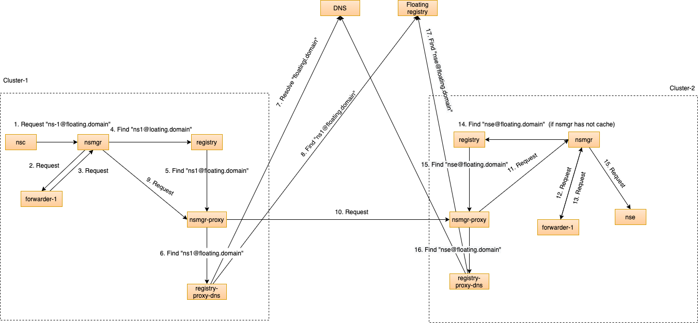

# Basic floating interdomain examples

### Floating interdomain

Basic floating interdomain examples includes the next setup:



### Interdomain
Interdomain tests can be on two clusters, for thus tests scheme of request will look as:


## Requires

- [Interdomain-DNS](./dns)
- [Interdomain-spire](./spire)
- [Load balancer](./loadbalancer)

## Includes

- [Kernel to VXLAN to Kernel Connection](./usecases/Kernel2Vxlan2Kernel)
- [Kernel to VXLAN to Kernel Connection via floating registry](./usecases/FloatingKernel2Vxlan2Kernel)

## Run

**1. Apply deployments for cluster1:**

```bash
export KUBECONFIG=$KUBECONFIG1
```

```bash
kubectl create ns nsm-system
```

Register `nsm-system` namespace in spire:

```bash
kubectl exec -n spire spire-server-0 -- \
/opt/spire/bin/spire-server entry create \
-spiffeID spiffe://nsm.cluster1/ns/nsm-system/sa/default \
-parentID spiffe://nsm.cluster1/ns/spire/sa/spire-agent \
-selector k8s:ns:nsm-system \
-selector k8s:sa:default \
-federatesWith spiffe://nsm.cluster2 \
-federatesWith spiffe://nsm.cluster3
```

Register `registry-k8s-sa` in spire:

```bash
kubectl exec -n spire spire-server-0 -- \
/opt/spire/bin/spire-server entry create \
-spiffeID spiffe://nsm.cluster1/ns/nsm-system/sa/registry-k8s-sa \
-parentID spiffe://nsm.cluster1/ns/spire/sa/spire-agent \
-selector k8s:ns:nsm-system \
-selector k8s:sa:registry-k8s-sa \
-federatesWith spiffe://nsm.cluster2 \
-federatesWith spiffe://nsm.cluster3
```

Register `nsmgr-proxy-sa` in spire:

```bash
kubectl exec -n spire spire-server-0 -- \
/opt/spire/bin/spire-server entry create \
-spiffeID spiffe://nsm.cluster1/ns/nsm-system/sa/nsmgr-proxy-sa \
-parentID spiffe://nsm.cluster1/ns/spire/sa/spire-agent \
-selector k8s:ns:nsm-system \
-selector k8s:sa:nsmgr-proxy-sa \
-federatesWith spiffe://nsm.cluster2 \
-federatesWith spiffe://nsm.cluster3
```

Apply NSM resources for basic tests:

```bash
kubectl apply -k https://github.com/networkservicemesh/deployments-k8s/examples/interdomain?ref=ff1971140cc0ce3521ecb7a1552ea189939bbd1f
```

**2. Apply deployments for cluster2:**

```bash
export KUBECONFIG=$KUBECONFIG2
```

```bash
kubectl create ns nsm-system
```

Register `nsm-system` namespace in spire:

```bash
kubectl exec -n spire spire-server-0 -- \
/opt/spire/bin/spire-server entry create \
-spiffeID spiffe://nsm.cluster2/ns/nsm-system/sa/default \
-parentID spiffe://nsm.cluster2/ns/spire/sa/spire-agent \
-selector k8s:ns:nsm-system \
-selector k8s:sa:default \
-federatesWith spiffe://nsm.cluster1 \
-federatesWith spiffe://nsm.cluster3
```

Register `registry-k8s-sa` in spire:

```bash
kubectl exec -n spire spire-server-0 -- \
/opt/spire/bin/spire-server entry create \
-spiffeID spiffe://nsm.cluster2/ns/nsm-system/sa/registry-k8s-sa \
-parentID spiffe://nsm.cluster2/ns/spire/sa/spire-agent \
-selector k8s:ns:nsm-system \
-selector k8s:sa:registry-k8s-sa \
-federatesWith spiffe://nsm.cluster1 \
-federatesWith spiffe://nsm.cluster3
```

Register `nsmgr-proxy-sa` in spire:

```bash
kubectl exec -n spire spire-server-0 -- \
/opt/spire/bin/spire-server entry create \
-spiffeID spiffe://nsm.cluster2/ns/nsm-system/sa/nsmgr-proxy-sa \
-parentID spiffe://nsm.cluster2/ns/spire/sa/spire-agent \
-selector k8s:ns:nsm-system \
-selector k8s:sa:nsmgr-proxy-sa \
-federatesWith spiffe://nsm.cluster1 \
-federatesWith spiffe://nsm.cluster3
```

Apply NSM resources for basic tests:

```bash
kubectl apply -k https://github.com/networkservicemesh/deployments-k8s/examples/interdomain?ref=ff1971140cc0ce3521ecb7a1552ea189939bbd1f
```


**3. Apply deployments for cluster3:**

```bash
export KUBECONFIG=$KUBECONFIG3
```

```bash
kubectl create ns nsm-system
```

Register `nsm-system` namespace in spire:

```bash
kubectl exec -n spire spire-server-0 -- \
/opt/spire/bin/spire-server entry create \
-spiffeID spiffe://nsm.cluster3/ns/nsm-system/sa/default \
-parentID spiffe://nsm.cluster3/ns/spire/sa/spire-agent \
-selector k8s:ns:nsm-system \
-selector k8s:sa:default \
-federatesWith spiffe://nsm.cluster1 \
-federatesWith spiffe://nsm.cluster2
```

Register `registry-k8s-sa` in spire:

```bash
kubectl exec -n spire spire-server-0 -- \
/opt/spire/bin/spire-server entry create \
-spiffeID spiffe://nsm.cluster3/ns/nsm-system/sa/registry-k8s-sa \
-parentID spiffe://nsm.cluster3/ns/spire/sa/spire-agent \
-selector k8s:ns:nsm-system \
-selector k8s:sa:registry-k8s-sa \
-federatesWith spiffe://nsm.cluster1 \
-federatesWith spiffe://nsm.cluster2
```

Apply NSM resources for basic tests:

```bash
kubectl apply -k github.com/networkservicemesh/deployments-k8s/apps/registry-k8s?ref=ff1971140cc0ce3521ecb7a1552ea189939bbd1f
```

## Cleanup

To free resouces follow the next command:

```bash
export KUBECONFIG=$KUBECONFIG1 && kubectl delete ns nsm-system
```
```bash
export KUBECONFIG=$KUBECONFIG2 && kubectl delete ns nsm-system
```
```bash
export KUBECONFIG=$KUBECONFIG3 && kubectl delete ns nsm-system
```
