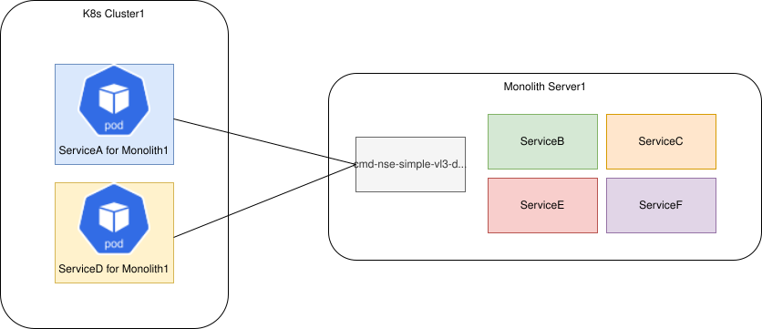

# Breaking up an application monolith with NSM

**_This example only works with kind kubernetes cluster_**

There are many existing applications in the world which consist of a collection of monolith servers.
If we want break such monoliths up into cloud native apps bit by bit by pulling services out into Pods, we can use this example.
It shows how to establish communications between these services that have been pulled into Pods and those services that remain on the monolith.

This is achieved by running a docker container on the monolith server:



## Requires

- [Docker container](./docker)
- [Load balancer](./loadbalancer)
- [DNS](./dns)
- [spire](./spire)

## Includes

- [Kernel to Wireguard to Kernel Connection](./usecases/Kernel2Wireguard2Kernel)

## Run

```bash
kubectl create ns nsm-system
```

Apply NSM resources for basic tests:
```bash
kubectl apply -k https://github.com/networkservicemesh/deployments-k8s/examples/k8s_monolith/cluster-configuration?ref=7758662e8a91c411ed8740e9f76c3c921d87d321
```

Wait for registry service exposing:
```bash
kubectl get services registry -n nsm-system -o go-template='{{index (index (index (index .status "loadBalancer") "ingress") 0) "ip"}}'
```

## Cleanup

To free resources follow the next command:
```bash
kubectl delete ns nsm-system
```
