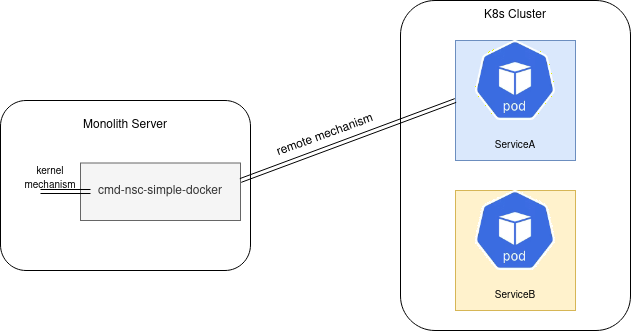

# NSC as external docker container

In this example we create a connection between an external NSC and the kubernetes cluster.
NSC requests the service and creates the required interface on the monolith:



## Requires

- [LoadBalancer](../configuration/loadbalancer)
- [Docker container](./docker)
- [DNS](./dns)
- Spire
    - [Spire in k8s](../../spire/single_cluster)
    - [Spiffe Federation](./spiffe_federation)

## Includes

- [Kernel to IP to Kernel Connection](./usecases/Kernel2IP2Kernel)

## Run

Apply NSM resources for basic tests:
```bash
kubectl apply -k https://github.com/networkservicemesh/deployments-k8s/examples/k8s_monolith/configuration/cluster?ref=5d6975a1f397e4b3007a46b919d34e176a1c4646
```

Wait for registry service exposing:
```bash
kubectl get services registry -n nsm-system -o go-template='{{index (index (index (index .status "loadBalancer") "ingress") 0) "ip"}}'
```

## Cleanup

To free resources follow the next command:
```bash
WH=$(kubectl get pods -l app=admission-webhook-k8s -n nsm-system --template '{{range .items}}{{.metadata.name}}{{"\n"}}{{end}}')
kubectl delete mutatingwebhookconfiguration ${WH}
kubectl delete ns nsm-system
```
