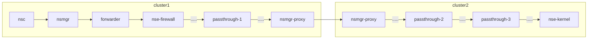

# Floating Intedomain NSE Composition Example

This example demonstrates a more complex Network Service, where we chain three passthrough and one ACL Filtering NS endpoints.

The chain is formed from NSEs which are located on different clusters. It involves a combination of local and remote mechanisms.

All NSEs are registered in the floating registry.


Interdomain NSE Composition Scheme

## Requires

Make sure that you have completed steps from [interdomain](../../)

## Run

**1. Deploy network service on cluster3**

Deploy NS:
```bash
kubectl --kubeconfig=$KUBECONFIG3 apply -k https://github.com/networkservicemesh/deployments-k8s/examples/multicluster/usecases/floating_nse_composition/cluster3?ref=777c5a656769d83eb31b746b4e77048aac9eecd3
```

**2. Deploy endpoints on cluster2**

Deploy NSE:
```bash
kubectl --kubeconfig=$KUBECONFIG2 apply -k https://github.com/networkservicemesh/deployments-k8s/examples/multicluster/usecases/floating_nse_composition/cluster2?ref=777c5a656769d83eb31b746b4e77048aac9eecd3
```

Wait for applications ready:
```bash
kubectl --kubeconfig=$KUBECONFIG2 wait --for=condition=ready --timeout=1m pod -l app=nse-kernel -n ns-nse-composition
```

Find NSE pod by labels:
```bash
NSE=$(kubectl --kubeconfig=$KUBECONFIG2 get pods -l app=nse-kernel -n ns-nse-composition --template '{{range .items}}{{.metadata.name}}{{"\n"}}{{end}}')
[[ ! -z $NSE ]]
```

**2. Deploy client on cluster1**

Deploy NSC:
```bash
kubectl --kubeconfig=$KUBECONFIG1 apply -k https://github.com/networkservicemesh/deployments-k8s/examples/multicluster/usecases/floating_nse_composition/cluster1?ref=777c5a656769d83eb31b746b4e77048aac9eecd3
```

Wait for applications ready:
```bash
kubectl --kubeconfig=$KUBECONFIG1 wait --for=condition=ready --timeout=5m pod -l app=alpine -n ns-nse-composition
```

Find NSC pod by labels:
```bash
NSC=$(kubectl --kubeconfig=$KUBECONFIG1 get pods -l app=alpine -n ns-nse-composition --template '{{range .items}}{{.metadata.name}}{{"\n"}}{{end}}')
[[ ! -z $NSC ]]
```

**3. Check connectivity**

Ping from NSC to NSE:
```bash
kubectl --kubeconfig=$KUBECONFIG1 exec ${NSC} -n ns-nse-composition -- ping -c 4 172.16.1.100
```

Check TCP Port 8080 on NSE is accessible to NSC
```bash
kubectl --kubeconfig=$KUBECONFIG1 exec ${NSC} -n ns-nse-composition -- wget -O /dev/null --timeout 5 "172.16.1.100:8080"
```

Check TCP Port 80 on NSE is inaccessible to NSC
```bash
kubectl --kubeconfig=$KUBECONFIG1 exec ${NSC} -n ns-nse-composition -- wget -O /dev/null --timeout 5 "172.16.1.100:80"
if [ 0 -eq $? ]; then
  echo "error: port :80 is available" >&2
  false
else
  echo "success: port :80 is unavailable"
fi
```

Ping from NSE to NSC:
```bash
kubectl --kubeconfig=$KUBECONFIG2 exec ${NSE} -n ns-nse-composition -- ping -c 4 172.16.1.101
```

## Cleanup

1. Cleanup resources for *cluster1*:
```bash
kubectl --kubeconfig=$KUBECONFIG1 delete ns ns-nse-composition
```

2. Cleanup resources for *cluster2*:
```bash
kubectl --kubeconfig=$KUBECONFIG2 delete ns ns-nse-composition
```

3. Cleanup resources for *cluster3*:
```bash
kubectl --kubeconfig=$KUBECONFIG3 delete ns ns-nse-composition
```
