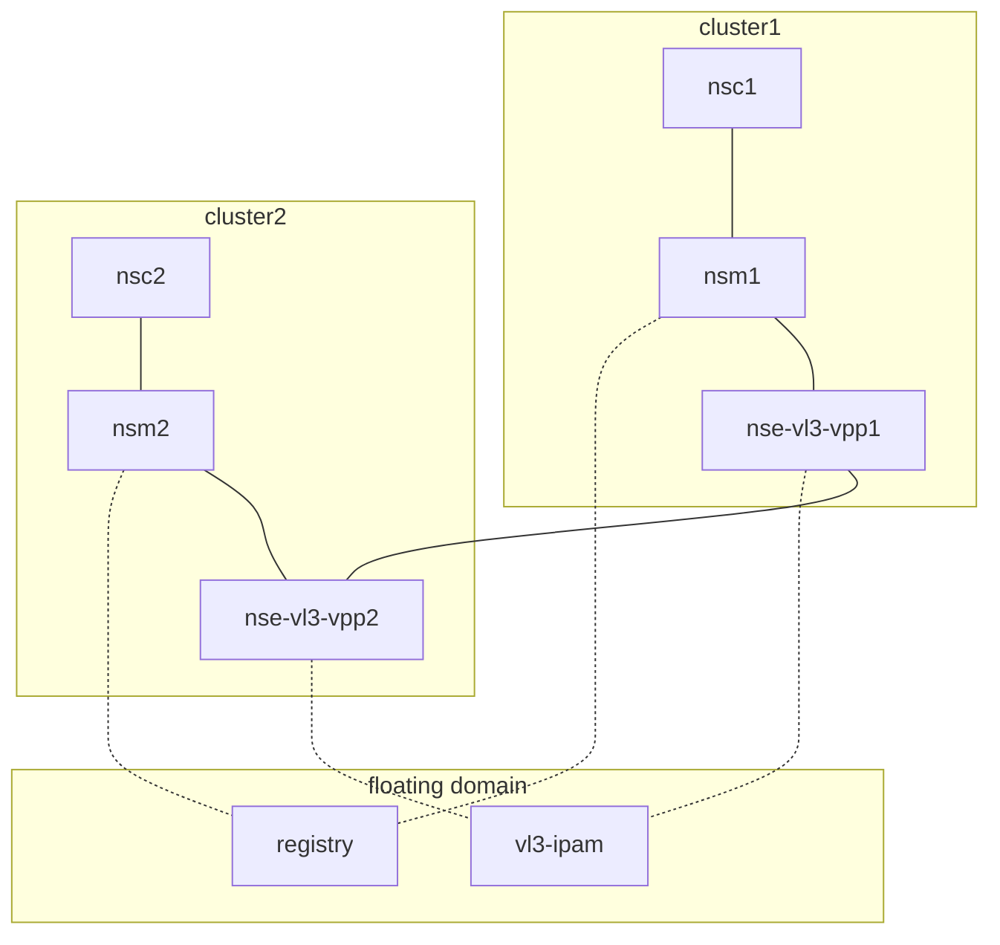

# NSM over interdomain vL3 network

## Description

This example show how can be configured NSM over interdomain via vL3 network.


## Requires

Make sure that you have completed steps from [interdomain](../../)

## Run

**1. Deploy**

Start **vl3 ipam** and register **vl3 network service** in the *floating domain*.

Note: *By default ipam prefix is `172.16.0.0/16` and client prefix len is `24`. We also have two vl3 nses in this example. So we expect to have two vl3 addresses: `172.16.0.0` and `172.16.1.0` that should be accessible by each client.*

```bash
kubectl --kubeconfig=$KUBECONFIG3 apply -k https://github.com/networkservicemesh/deployments-k8s/examples/multicluster/usecases/floating_vl3-basic/cluster3?ref=8ffe6e4e7612eb458c9acc70ed84b75b9cb6629b
```

Deploy a vl3-NSE and a client on the cluster1:
```bash
kubectl --kubeconfig=$KUBECONFIG1 apply -k https://github.com/networkservicemesh/deployments-k8s/examples/multicluster/usecases/floating_vl3-basic/cluster1?ref=8ffe6e4e7612eb458c9acc70ed84b75b9cb6629b
```

Deploy a vl3-NSE and a client on the cluster2:
```bash
kubectl --kubeconfig=$KUBECONFIG2 apply -k https://github.com/networkservicemesh/deployments-k8s/examples/multicluster/usecases/floating_vl3-basic/cluster2?ref=8ffe6e4e7612eb458c9acc70ed84b75b9cb6629b
```

**2. Wait for clients to be ready**

```bash
kubectl --kubeconfig=$KUBECONFIG2 wait --for=condition=ready --timeout=1m pod -l app=alpine -n ns-floating-vl3-basic
```
```bash
kubectl --kubeconfig=$KUBECONFIG1 wait --for=condition=ready --timeout=1m pod -l app=alpine -n ns-floating-vl3-basic
```

**3. Check connectivity**

Get assigned IP address from the vl3-NSE for the NSC2 and ping from the remote client (NSC1):
```bash
ipAddr2=$(kubectl --kubeconfig=$KUBECONFIG2 exec -n ns-floating-vl3-basic pods/alpine -- ifconfig nsm-1)
ipAddr2=$(echo $ipAddr2 | grep -Eo 'inet addr:[0-9]{1,3}\.[0-9]{1,3}\.[0-9]{1,3}\.[0-9]{1,3}'| cut -c 11-)
kubectl --kubeconfig=$KUBECONFIG1 exec pods/alpine -n ns-floating-vl3-basic -- ping -c 4 $ipAddr2
```

Ping vl3 nses from cluster1:
```bash
kubectl --kubeconfig=$KUBECONFIG1 exec pods/alpine -n ns-floating-vl3-basic -- ping -c 4 172.16.0.0
kubectl --kubeconfig=$KUBECONFIG1 exec pods/alpine -n ns-floating-vl3-basic -- ping -c 4 172.16.1.0
```

Get assigned IP address from the vl3-NSE for the NSC1 and ping from the remote client (NSC2):
```bash
ipAddr1=$(kubectl --kubeconfig=$KUBECONFIG1 exec -n ns-floating-vl3-basic pods/alpine -- ifconfig nsm-1)
ipAddr1=$(echo $ipAddr1 | grep -Eo 'inet addr:[0-9]{1,3}\.[0-9]{1,3}\.[0-9]{1,3}\.[0-9]{1,3}'| cut -c 11-)
kubectl --kubeconfig=$KUBECONFIG2 exec pods/alpine -n ns-floating-vl3-basic -- ping -c 4 $ipAddr1
```

Ping vl3 nses cluster2:
```bash
kubectl --kubeconfig=$KUBECONFIG2 exec pods/alpine -n ns-floating-vl3-basic -- ping -c 4 172.16.0.0
kubectl --kubeconfig=$KUBECONFIG2 exec pods/alpine -n ns-floating-vl3-basic -- ping -c 4 172.16.1.0
```

## Cleanup

Cleanup floating domain:
```bash
kubectl --kubeconfig=$KUBECONFIG3 delete -k https://github.com/networkservicemesh/deployments-k8s/examples/multicluster/usecases/floating_vl3-basic/cluster3?ref=8ffe6e4e7612eb458c9acc70ed84b75b9cb6629b
```

Cleanup cluster2 domain:
```bash
kubectl --kubeconfig=$KUBECONFIG2 delete -k https://github.com/networkservicemesh/deployments-k8s/examples/multicluster/usecases/floating_vl3-basic/cluster2?ref=8ffe6e4e7612eb458c9acc70ed84b75b9cb6629b
```

Cleanup cluster1 domain:
```bash
kubectl --kubeconfig=$KUBECONFIG1 delete -k https://github.com/networkservicemesh/deployments-k8s/examples/multicluster/usecases/floating_vl3-basic/cluster1?ref=8ffe6e4e7612eb458c9acc70ed84b75b9cb6629b
```
