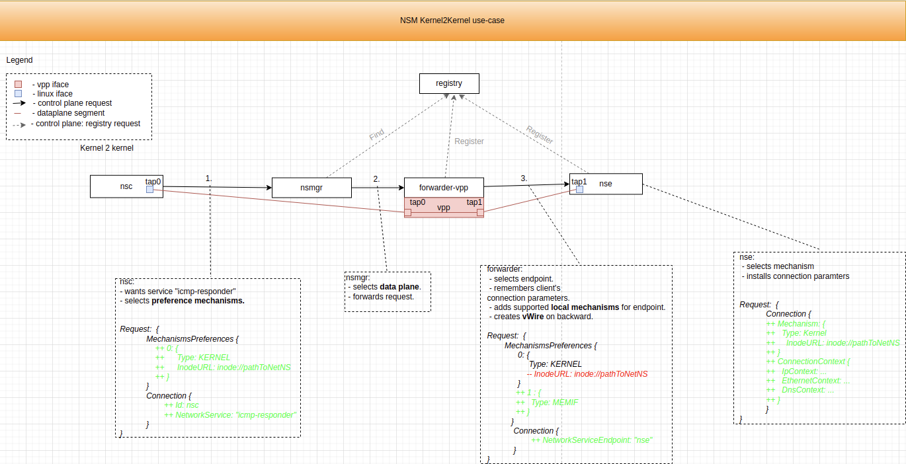

# Test kernel to kernel connection


This example shows that NSC and NSE on the one node can find each other. 

NSC and NSE are using the `kernel` mechanism to connect to its local forwarder.


Diagram:




## Requires

Make sure that you have completed steps from [basic](../../basic) or [memory](../../memory) setup.

## Run

Create test namespace:
```bash
kubectl create ns ns-kernel2kernel
```

Deploy NSC and NSE:
```bash
kubectl apply -k https://github.com/networkservicemesh/deployments-k8s/examples/use-cases/Kernel2Kernel?ref=1b77b5b89d32088a13e654cb64302a14ad0cb5da
```

Wait for applications ready:
```bash
kubectl wait --for=condition=ready --timeout=1m pod -l app=alpine -n ns-kernel2kernel
```
```bash
kubectl wait --for=condition=ready --timeout=1m pod -l app=nse-kernel -n ns-kernel2kernel
```

Find nsc and nse pods by labels:
```bash
NSC=$(kubectl get pods -l app=alpine -n ns-kernel2kernel --template '{{range .items}}{{.metadata.name}}{{"\n"}}{{end}}')
```
```bash
NSE=$(kubectl get pods -l app=nse-kernel -n ns-kernel2kernel --template '{{range .items}}{{.metadata.name}}{{"\n"}}{{end}}')
```

Ping from NSC to NSE:
```bash
kubectl exec ${NSC} -n ns-kernel2kernel -- ping -c 4 172.16.1.100
```

Ping from NSE to NSC:
```bash
kubectl exec ${NSE} -n ns-kernel2kernel -- ping -c 4 172.16.1.101
```

## Cleanup

Delete ns:
```bash
kubectl delete ns ns-kernel2kernel
```
